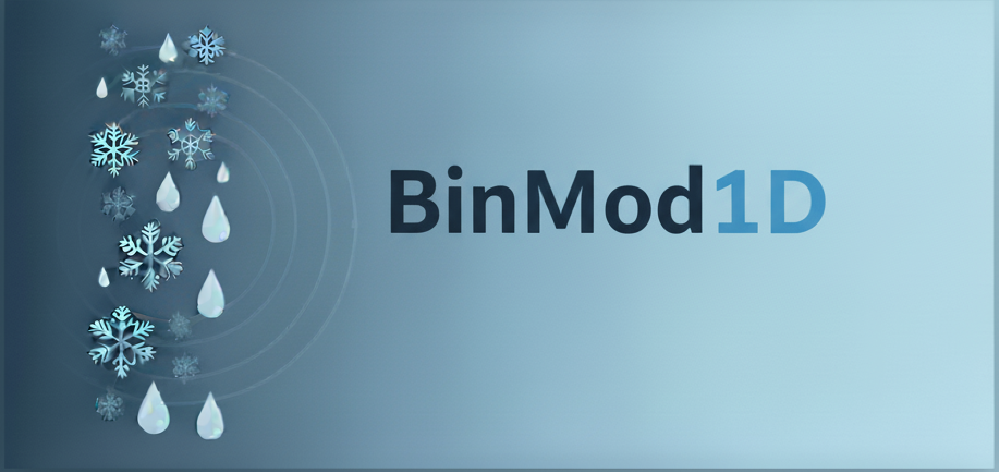

This repository contains the BinMod1D python code. This is a python-based 1D bin (spectral) microphysical model designed to explicitly simulate collision-coalescence and collisional breakup. In order to use the code:

1.) Initialize the spectral model using the spectral_1d class: 

```python
from spectral_model import spectral_1d

s1 = spectral_1D()
```

The inputs to this class will specify the initial gamma particle size distribution (PSD), the bin resolution (sbin) and number of bins used (bins), as well as other parameters that determine how the model will be run.

2.) Use the spectral_1D.run() method to run the model with the inputs specified in spectral_1D()

```python
s1.run()
```

Various methods are included in the spectral_1d.py class that allow for easy plotting of bin model results.
